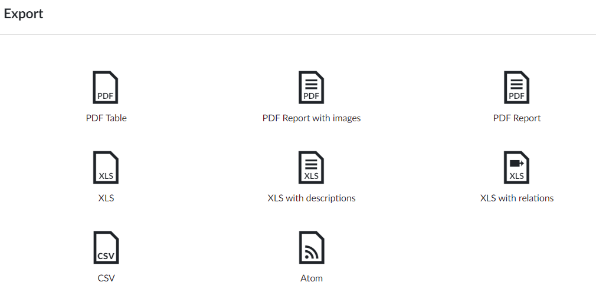

# Smart Agriculture

### Artificial Intelligence in Agriculture Market Size, Share & Industry Growth Analysis Report by Technology (Machine Learning, Computer Vision, and Predictive Analytics), Offering (Software, AI-as-a-Service), Application (Drone Analytics, Precision Farming) and Region - Global Forecast to 2028

<figure><figcaption></figcaption></figure>

### Artificial Intelligence in Agriculture Market Report Scope

<table data-header-hidden><thead><tr><th valign="top"></th><th valign="top"></th></tr></thead><tbody><tr><td valign="top"><strong>Report Metric</strong></td><td valign="top"><strong>Details</strong></td></tr><tr><td valign="top"></td><td valign="top"></td></tr><tr><td valign="top"><mark style="background-color:blue;"><strong>Estimated Market Size</strong></mark></td><td valign="top"><mark style="background-color:blue;"><strong>USD 1.7 billion in 2023</strong></mark></td></tr><tr><td valign="top"><mark style="background-color:blue;"><strong>Expected Market Siz</strong></mark><strong>e</strong></td><td valign="top"><mark style="background-color:blue;"><strong>U</strong></mark><strong>SD 4.7 billion by 2028</strong></td></tr><tr><td valign="top"><strong>Growth Rate</strong></td><td valign="top"><strong>CAGR of 23.1%</strong></td></tr><tr><td valign="top"><strong>Market size available for years</strong></td><td valign="top">2019—2028</td></tr><tr><td valign="top"><strong>Base year</strong></td><td valign="top">2022</td></tr><tr><td valign="top"><strong>Forecast period</strong></td><td valign="top">2023—2028</td></tr><tr><td valign="top"><strong>Units</strong></td><td valign="top">Value (USD Billion)</td></tr><tr><td valign="top"><strong>Segments covered</strong></td><td valign="top">Technology, offering, application, and geography.</td></tr><tr><td valign="top"><strong>Geographic regions covered</strong></td><td valign="top">North America, Europe, Asia Pacific, and RoW</td></tr><tr><td valign="top"><strong>Companies:</strong> major players in the market</td><td valign="top">
Deere &#x26; Company (US), 

IBM (US), 

Microsoft (US), 

The Climate Corporation (US), 

AgEagle Aerial Systems Inc. (US), 

Descartes Labs, Inc. (US) 

Farmers Edge Inc. (Canada), 

Granular Inc. (Canada)
</td></tr></tbody></table>

### Artificial Intelligence in Agriculture Market Trends:

#### Rising need for real-time data by growers and farmers to take preventive measures

Increasing agricultural activities and the growing need for real-time data largely drive the market for AI in agriculture. Real-time data from agricultural farms help make prompt decisions regarding preventive measures. Farmers from North America, South America, and Europe use sensors, drones, guidance technologies, and soil sampling techniques to gather data on soil moisture and nutrient levels across their fields. Farmers and growers from the US, Canada, Brazil, and most Western European countries are turning to high-tech tools for data collection and data analysis. Drone-enabled scouting is one of the most convenient ways of collecting farm data.

#### Government schemes encouraging adoption of AI solutions to manage small farms

There are over 570 million farms worldwide, and 95% of all these farms are less than 5 hectares in size. AI solutions are predominantly implemented in farms with over 100 hectares of land. This can be attributed to the high initial investment required for implementing AI solutions. Farmers owning lands over 100 hectares generally have the capability to invest in AI-based solutions for farm management and other applications. However, with governments around the world supporting the use of AI for agricultural applications and providing aid to farmers with small farms, there is an opportunity for solution providers to focus on farms with less than 5 hectares of land. For instance, in the US, the Department of Agriculture provides small and mid-size producers with programs that avail farmers with easy loans and improve their technological know-how to use the best technology for farming.

#### High cost of AI-driven precision farming equipment

The major restraining factor for the AI in agricultural market is the high cost of AI-enabled farming products and solutions, including sensors, software, and robots. Many factors are responsible for the high cost of gathering precise field data. For instance, companies develop AI-powered solutions or platforms according to customer requirements. They offer AI-powered prebuilt and custom-built solutions such as analytics systems, virtual assistants, and chatbots. Similarly, AI features and AI management are also important factors that incur additional costs.

### Availability of limited workforce with technological expertise

Artificial intelligence (AI) is a complex system, and for developing, managing, and successfully implementing AI systems, farmers require certain skill sets. For instance, people dealing with AI systems should know about technologies such as cognitive computing, machine learning, deep learning, and image recognition. In addition, the integration of AI solutions in existing systems is a difficult task that requires extensive data processing to replicate the behavior of a human brain. Even a minor error can result in system failure or adversely affect the desired result.
